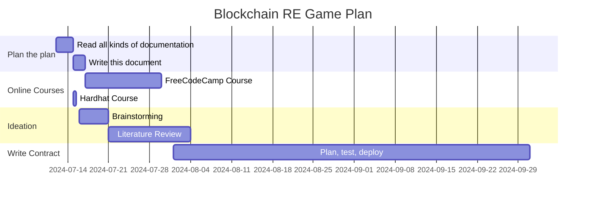

## Purpose
To develop experience across all the different verticals and explore interests in both blockchain and Real Estate.

## Game Plan
    1. Learn from online courses on Blockchain contracts development.
    2. Ideate.
    3. Create!

## FreeCodeCamp Course 

Notes for the course are written [here]()! It is a really comprehensive course for solidity, blockchain and smart contracts in Python. 

## Literature Review

Consulted good sources of information such as ChatGPT, existing business models and books for ideas.

A more detailed writeup can be found [here]()

## Writing Contract